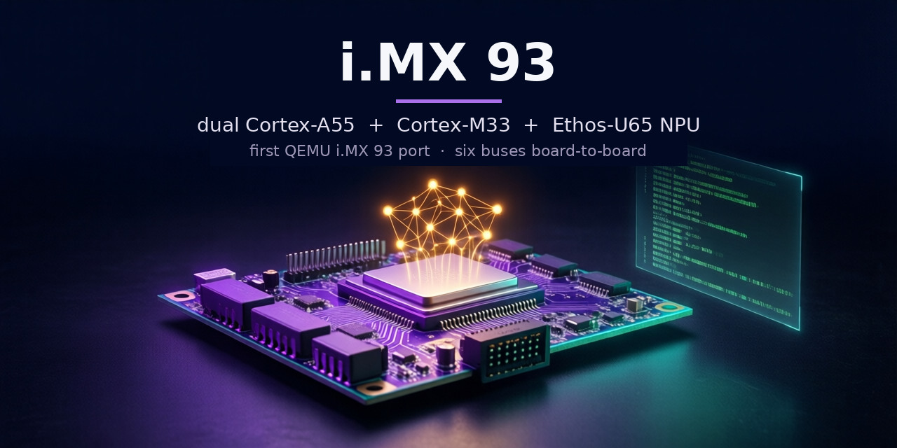
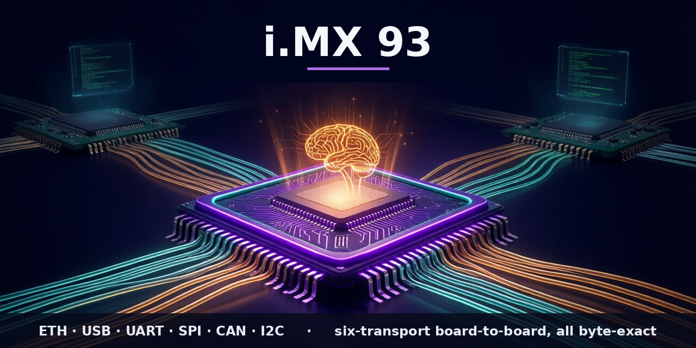

# qemu-imx93

A QEMU machine type for the NXP **i.MX 93** SoC, targeting the **11×11 EVK**
(LPDDR4X) variant.

> **This is a fork of QEMU mainline.** The i.MX 93 work lives on the
> `imx93-dev` branch (the repository default and the upstream candidate), from
> its tip back to the upstream branch point `edcc429e9e`; the vast majority of
> the history is inherited from upstream QEMU. A `main` branch pins that
> upstream base, so `git diff main...imx93-dev` shows exactly the port. The
> upstream QEMU README is preserved at [`README.rst`](README.rst) — this file
> describes the i.MX 93-specific work.

qemu-imx93 is the **first QEMU model of the i.MX 93**, and one node in a fleet of
NXP QEMU ports (i.MX 91 / 93 / 95 and the MCXN947 microcontroller) that share
device models and a validation standard. The i.MX 93 is the **full A55-line part**:
**dual Cortex-A55** plus a **Cortex-M33** real-time core, an **Ethos-U65 microNPU**,
and the **PXP** 2D engine — the i.MX 91 is literally this SoC with those blocks
subtracted. Unlike the i.MX 95 it has **no System Manager**: Linux programs the
CCM / ANATOP / SRC / power domains directly, so those are modelled functionally
rather than served by M33 firmware over SCMI. It is not cycle-accurate.

It boots stock **NXP BSP Linux 6.12.49 to userspace** on both A55 cores, on the
**stock `imx93-11x11-evk` device tree with no DT modifications** — and a **vanilla
mainline kernel** on the upstream dts (i.MX 93 support has been upstream since
~v6.3), a fully-OSS boot that doubles as the upstream CI functional test. Beyond
booting it brings up essentially the whole EVK — display, camera, audio, the M33
with A55↔M33 RPMsg, and **bit-exact int8 NPU inference** — and **passes real data
between instances over six board buses** (see
[Interconnect](#interconnect--board-to-board-mission-5)). Intended use: BSP and
peripheral-driver development, multicore/RPMsg and NPU bring-up, multi-board lab
work, and CI; the long-term aim is upstream-mergeability into QEMU mainline.

**Maintainer:** Kyle Fox ([@kylefoxaustin](https://github.com/kylefoxaustin)) (see `MAINTAINERS` for the canonical entry)

*Not a mockup: the second image is a live QMP screendump — real NXP BSP Linux
scanned out at 1920×1080 by the emulated LCDIFv3 over the DSI → ADV7535 → HDMI
chain. Two Tux logos = two Cortex-A55 cores.*

## Quickstart

This fork **builds and runs as-is** — a plain clone lands on `imx93-dev`.

**1. Clone and build** (host packages under [Building](#building)):

    git clone https://github.com/kylefoxaustin/qemu-imx93.git
    cd qemu-imx93
    mkdir build && cd build
    ../configure --target-list=aarch64-softmmu
    ninja qemu-system-aarch64
    ./qemu-system-aarch64 -M help | grep imx93     # -> imx93-11x11-evk

**2. First boot in seconds — no external artifacts.** A bare-metal LPUART "hello"
proves the machine + console without downloading anything from NXP (needs an
`aarch64-linux-gnu` bare-metal toolchain):

    cd tests/hello-imx93 && make && cd ../..
    ./build/qemu-system-aarch64 -M imx93-11x11-evk -nographic -m 2G \
        -kernel tests/hello-imx93/hello.bin      # -> "Hello from i.MX 93!"

**3. The full stack — Linux to userspace.** You need a kernel `Image`, the
`imx93-11x11-evk.dtb`, and a rootfs — from the NXP BSP or fully-OSS mainline (see
[Required artifacts](#required-artifacts)). The easy path is
`tests/boot-imx93/run.sh` (serial) or `tests/login-imx93/run.sh` (interactive
login on the emulated HDMI display); the equivalent manual invocation:

    ./build/qemu-system-aarch64 -M imx93-11x11-evk -m 4G -display none \
        -kernel <Image> -dtb <imx93-11x11-evk.dtb> -initrd <rootfs.cpio.gz> \
        -append "earlycon=lpuart32,mmio32,0x44380010 console=ttyLP0,115200 cpuidle.off=1 rdinit=/init" \
        -serial mon:stdio -serial null

Three details are load-bearing:

- **The i.MX 93 has a fixed 3-CPU topology** (2× A55 + the M33) — run with
  `-smp 3` (the default). The M33 stays in reset for a plain Linux boot.
- **earlycon address `0x44380010`, not `0x44380000`.** The LPUART has
  VERID/PARAM/GLOBAL/PINCFG at 0x00–0x0C and BAUD at 0x10; Linux's driver applies
  the `reg_off = 0x10` automatically, but earlycon does not, so the cmdline
  address must be pre-offset.
- **`cpuidle.off=1`** is the conservative first-boot default (avoids the GICv3
  WakeRequest gap shared by all GICv3 QEMU machines).

## What runs today

Stock **NXP Linux 6.12.49** boots to userspace (PID 1) on both Cortex-A55 cores,
on the **stock `imx93-11x11-evk` device tree — no DT modifications**. This table
is the condensed capability view; the per-IP-block evidence, with the same
**Tier / N-A** language, lives in
[`docs/validation/test-result-matrix.md`](docs/validation/test-result-matrix.md)
(one source of truth, `test-matrix.yaml`, two renderings). Tiers: **A** data-path
verified (real data moves, integrity-checked) · **B** driver bring-up (binds,
registers/IRQ/timing correct) · **N/A** absent on i.MX 93 silicon (never a
failure).

| Subsystem | Tier | Evidence |
|---|:--:|---|
| Dual Cortex-A55 SMP, GICv3 | A | Boots NXP + mainline Linux to a shell on `ttyLP0`; clean PSCI power-off |
| Cortex-M33 + A55↔M33 RPMsg (MU1) | A | Real NXP FreeRTOS firmware; `rpmsg_lite` ping-pong round-trips over shared vrings |
| Ethos-U65 microNPU | A | **Bit-exact int8 inference** in-QEMU — `hw/npu/` executor runs the Vela command stream (mlw decode, conv/dw/pool/elementwise, gemmlowp requant); output matches host TFLite; 19 unit + 12 qtest subtests |
| eDMA1 / eDMA2 | A | Real TCD execution — LPI2C EDID read, cyclic scatter-gather audio pacing, per-`CHn_MUX` routing |
| Networking — FEC (`eth0`) + eQOS/dwmac4 (`eth1`) | A | Both DHCP; real frames; **board-to-board** byte-exact |
| Storage — uSDHC | A | SDHCI ADMA; ext4 `mmcblk0` r/w/sync from `-drive if=sd` |
| Display — LCDIFv3 → DSI → ADV7535 → HDMI (+ LVDS) | A | 1920×1080 `/dev/fb0`, framebuffer scanned out + screendump byte-correct; fbcon login |
| Camera — MT9M114/OV5640 → CSI → ISI → V4L2 | A | 5/5 byte-checked frames off `/dev/video0` (parallel + MIPI-CSI2); host-image "virtual camera" |
| Audio — SAI3/WM8962 play + capture, MICFIL PDM, XCVR/SPDIF | A | Real PCM via cyclic eDMA2; `-audio driver=wav` captures a played square wave byte-correct; concurrent streams |
| PXP 2D (G2D) | A | copy/fill/blit/src-over-blend/rotate byte-exact (`libg2d` → `/dev/pxp_device` → model); `use-g2d=true` Weston composites through it |
| LPUART ×8 | A | Serial console; DMA-mode RX (cyclic eDMA); **board-to-board** byte-exact |
| LPSPI ×8 | A | Per-bus SSI master; `is25lp064` JEDEC byte-exact; drives **board-to-board SPI** (spi-link) |
| LPI2C ×8 (+ PMIC/expanders), FlexIO-as-I²C | A | `-device …,bus=lpi2cN` enumerated + read byte-exact; drives **board-to-board I²C** (i2c-link) |
| FlexCAN ×2 | A | `can0` up; frame round-trip; **board-to-board** (can-host-chardev) |
| ChipIdea USB host (`ci_hdrc`) | A | `usb-storage`/`usb-kbd` enumerate; usbredir host — **bulk-echo + CDC `/dev/ttyACM0`** byte-exact |
| I3C1 (Silvaco) | B | I3C master bridges to legacy-I²C; wm8962-on-I3C audio card registers |
| CCM/ANATOP/SRC/power, ELE, OCOTP/BBNSM/SEMA42, SYSCTR/TMU/WDOG, MICFIL/XCVR, GPIO/PMIC, FlexSPI, ADC | B | Drivers bind; registers/IRQ/timing correct (ELE + NPU carry opt-in honest-fault rails) |

**Absent on i.MX 93 silicon — N/A (never a failure):**

| Block | Why absent |
|---|---|
| System Manager (SM/SCMI) | i.MX 91/93 have none; Linux programs CCM/ANATOP/SRC directly (vs the i.MX 95) |
| Hardware JPEG/video codec (CAST) | i.MX 95-only; on the i.MX 93 multimedia is software on the A55s (GStreamer proves the path) |
| 3D GPU (compute) | No emulatable GPU compute; Weston is software-rendered (Mesa softpipe / pixman) — the 2D PXP is present |

**SoC identity is correct.** The chip id reports `i.MX93`, rev 1.0; no downstream
`0x9300` artifact leaks. The machine also runs the BSP's variant DTBs (i3c, flexio,
LVDS panel, MIPI-CSI, …) to userspace.

## Interconnect — board-to-board (mission #5)

Beyond running on one board, the i.MX 93 **passes real data between QEMU
instances** over its buses, in the per-link socket shape a lab coordinator
([holobench](https://github.com/kylefoxaustin/holobench)) wires — two emulated
boards hook up over a stock QEMU socket, no host kernel/root. Every link has a
byte-exact oracle. Harness:
[`tests/interconnect-imx93/`](tests/interconnect-imx93/).

| Transport | Shape | Status |
|---|---|:--:|
| **Ethernet** | two 93s, FEC `eth0` over `-nic socket` | PASS |
| **UART** | two 93s, LPUART2 `/dev/ttyLP1` over `-chardev socket` (DMA-mode RX) | PASS |
| **SPI** | two 93s, LPSPI1 `/dev/spidev0.0` via the **`spi-link`** device over `-chardev socket` | PASS |
| **CAN** | two 93s, FlexCAN `can0` via **`can-host-chardev`** over `-chardev socket` | PASS |
| **I²C** | two 93s, LPI2C3 via the **`i2c-link`** device over `-chardev socket` | PASS |
| **USB** | 93 as usbredir host ↔ an MCXN947 gadget: EP1 **bulk-echo** + **CDC-ACM** `/dev/ttyACM0` serial, byte-exact | PASS |

The three master/slave transports each use a **generic chardev-bridge device**,
shared across the fleet: **`spi-link`** (`hw/ssi/spi_link.c`, from the i.MX 91 — an
SSI peripheral bridging an SPI bus to a chardev), **`can-host-chardev`**
(`net/can/can_host_chardev.c`, from the i.MX 95 — a can-bus↔chardev bridge, no host
vcan/root), and **`i2c-link`** (`hw/i2c/i2c_link.c`, **originated here** — an
I2CSlave that bridges an I²C bus to a chardev as a mailbox). All are non-blocking
on tx so a continuous clock can't hang the vCPU. Bringing SPI up also drove out two
`imx93_lpspi` fixes the register qtest had passed over (`PARAM.PCSNUM` and per-frame
`FCF`), and a `imx93_edma` word-vs-byte element-size fidelity fix.

**Cross-SoC validated.** `spi_link.c`, `can-host-chardev`, and `i2c-link` are
proven byte-exact across **i.MX 91 / 93 / 95 / MCXN947** — PIO↔eDMA masters and
Linux↔bare-metal-M33 — so any two boards interoperate (every pairing of the four
closed). The USB-CDC link means a developer can **reach the emulated 93 like a real
EVK** — `/dev/ttyACM` serial over the link, `serial-getty` login on `ttyLP0`, `ssh`
over eQOS.

## Validation

Correctness rests on **five independent gates**, not one:

1. **Kernel-free qtests** on the `imx93-11x11-evk` machine (Ethos-U executor,
   PXP, ISI, SAI, LPI2C, LPSPI, FlexIO, FlexSPI — async timer races pinned with
   `clock_step`). CI-runnable; the matrix is assembled by
   [`docs/validation/gen-matrix.py`](docs/validation/gen-matrix.py), which reads
   Tier from `test-matrix.yaml` and stamps the result from the run — it gates on
   any qtest regression.
2. **AddressSanitizer + UBSan** sweep of the device models (zero findings).
3. **24-hour concurrent soak** ([`tests/soak/`](tests/soak/)) — every datapath
   concurrent (audio / NPU / PXP / I3C / camera / display / storage / net) across
   dozens of boot/power-off cycles; the final run was **0 incidents, flat RSS**.
4. **Vanilla-mainline boot** — a stock upstream kernel + mainline dts to
   userspace, confirming the model matches upstream (the QEMU-CI functional test).
5. **Interconnect + cross-SoC** — byte-exact board-to-board over all six
   transports, cross-validated against the i.MX 91 / 95 / MCXN947 nodes.

The recurring lesson: a green deterministic qtest is *not* validation for a model
with no live workload — the FlexIO IRQ-storm fix and the LPSPI PARAM/FCF fixes
only surfaced against a real-driver repro. Fidelity judgments (the NPU honest-fault
discipline, the PXP scale/CSC boundary) live in
[`docs/validation/fidelity-audit.md`](docs/validation/fidelity-audit.md).

## Required artifacts

To boot Linux you need three artifacts, all built from the
[NXP i.MX Yocto BSP](https://github.com/nxp-imx/meta-imx) (`MACHINE=imx93evk`):

| Artifact | Where from |
| --- | --- |
| Kernel `Image` | `linux-imx`, imx defconfig |
| `imx93-11x11-evk.dtb` (+ `…-i3c` / `…-flexio-i2c` / LVDS / CSI variants) | same kernel build |
| initramfs / rootfs | any aarch64 rootfs with `/init` (e.g. BSP `imx-image-core`; `core-image-weston` for the desktop) |

The `tests/*/run.sh` scripts take `KERNEL=`, `DTB=`, `INITRD=`, `QEMU=` env vars
and print exactly which to set if one is missing.

**No NXP access? A fully-OSS boot works too.** A vanilla mainline kernel
(`arm64 defconfig`, verified 6.12.x), the mainline `imx93-11x11-evk.dtb` (upstream
since ~v6.3), and the static-aarch64 BusyBox initramfs from
`tests/busybox-initramfs/` boot the machine to a shell with **zero NXP bits** — the
exact tuple the upstream functional test uses. The NXP BSP is only needed for the
*full* EVK userspace (Weston, GStreamer, the vendor drivers above).

## Building

    mkdir -p build && cd build
    ../configure --target-list=aarch64-softmmu
    ninja qemu-system-aarch64

**Host packages (Ubuntu 22.04+):**

    sudo apt install -y \
        meson ninja-build python3 python3-venv python3-tomli \
        gcc libc6-dev pkg-config libglib2.0-dev libpixman-1-dev \
        libgtk-3-dev binutils-aarch64-linux-gnu gcc-aarch64-linux-gnu

`libgtk-3-dev` gives the `-display gtk` window (interactive HDMI login);
`binutils/gcc-aarch64-linux-gnu` builds the bare-metal hello + the static
initramfs and interconnect oracles.

## Architecture overview

- **2× Cortex-A55** (GICv3 / GIC-600, no ITS) running Linux, DDR at
  `0x8000_0000`, plus a **1× Cortex-M33** real-time core — a heterogeneous ARMv8-M
  context with its own ITCM/DTCM and a secure peripheral window, held in reset
  until firmware is staged. It runs real NXP firmware and exchanges RPMsg with
  Linux over MU1 + shared vrings, and is the transport the Ethos-U65 NPU inference
  path rides on.
- **No System Manager** — Linux drives CCM / ANATOP / SRC / power domains directly
  (functional models, not SCMI-over-firmware) — the defining i.MX 93-vs-95 split.
- Real device models for everything boot/net/storage/display/camera/audio/USB/M33/
  NPU exercises: LPUART, CCM, ANATOP, MEDIAMIX (blk-ctrl GPR + SRC power slice),
  PXP, ELE MU, MU1, LPI2C + PMICs, GPIO, uSDHC, FEC + eQOS, eDMA1/2, LCDIFv3 + DSI
  + ADV7535 (+ LVDS), ISI + MT9M114/OV5640, SAI/MICFIL/XCVR/WM8962, FlexSPI,
  Silvaco I3C, ChipIdea USB, FlexCAN, LPSPI (+ the interconnect bridge devices),
  and virtio-mmio for input. Everything else is a logging stub.
- Structural conventions follow upstream `hw/arm/fsl-imx8mp.{c,h}`. All memory-map
  addresses and IRQ numbers come from the NXP BSP (`imx93.dtsi` / the Reference
  Manual), never guessed. The BSP uses its downstream `drm/imx` drivers; the
  machine also boots a vanilla mainline kernel, so it tracks both stacks.

## Repository tour

| Path | Purpose |
| --- | --- |
| `hw/arm/fsl-imx93.c`, `include/hw/arm/fsl-imx93.h` | SoC realization: A55 cluster + Cortex-M33, GIC, device wiring, memory map, logging stubs |
| `hw/arm/imx93-evk.c` | 11×11 EVK board file (SD attach, DTB virtio node injection, canbus links) |
| `hw/npu/ethos_u*.c`, `hw/npu/mlw/` | Generic Arm **Ethos-U executor** (`TYPE_ETHOS_U`): cmd-stream parse → DMA marshal → mlw decode → int8 conv/dw/pool/elementwise → OFM writeback + IRQ |
| `hw/misc/imx93_{ccm,anatop,media_blk,pxp,ele,flexio}.c`, `hw/misc/imx_mu.c` | clocks/PLLs, MEDIAMIX, PXP 2D, EdgeLock Enclave, FlexIO fabric, A55↔M33 mailbox |
| `hw/display/imx93_{lcdif,dsi,isi}.c`, `hw/display/adv7535.c` | LCDIFv3 scanout, MIPI-DSI host, ISI V4L2 capture, ADV7535 HDMI bridge |
| `hw/audio/imx93_{sai,micfil,xcvr}.c`, `hw/audio/wm8962.c` | SAI/MICFIL/XCVR + WM8962 codec |
| `hw/net/imx93_dwmac.c`, `hw/net/can/flexcan.c`, `hw/dma/imx93_edma.c` | eQOS dwmac4, FlexCAN, eDMA1/2 (one-shot TCD + cyclic SG) |
| `hw/i2c/imx_lpi2c.c` + `i2c_link.c`, `hw/ssi/imx93_lpspi.c` + `spi_link.c`, `net/can/can_host_chardev.c` | LPI2C/LPSPI masters + the **interconnect bridge devices** (i2c-link, spi-link, can-host-chardev) |
| `hw/char/imx_lpuart.c`, `hw/i2c/{mt9m114,ov5640}.c`, `hw/gpio/imx93_gpio.c`, `hw/i3c/svc_i3c.c` | LPUART (+ DMA-RX), camera sensors, GPIO, Silvaco I3C |
| `tests/qtest/imx93-*-test.c`, `tests/qtest/ethos-u-test.c` | kernel-free qtests on the machine |
| `tests/interconnect-imx93/` | board-to-board links: `run-{eth,uart,spi,can,i2c}.sh` + `run-spi-mcx.sh` (cross-SoC) |
| `tests/{boot,login,weston,gstreamer}-imx93/`, `tests/{audio,camera,pxp,flexio,i3c}-imx93/` | boot/desktop + per-subsystem data-path oracles |
| `tests/{m33-boot,m33-rpmsg,npu,ethosu-rpmsg,ethosu-caps,ethosu-infer}-*` | M33 bring-up, RPMsg, and the Ethos-U65 driver / round-trip / bit-exact inference |
| `tests/soak/`, `tests/hello-imx93/`, `tests/busybox-initramfs/` | 24 h soak, bare-metal hello, zero-NXP OSS rootfs |
| `docs/validation/` | the test-result matrix, fidelity audit, and `test-matrix.yaml` (tier source of truth) |

## Known limitations

- **`fsl-se … Failed to read tamper status` is benign.** The ELE registers fine;
  the tamper read is an NXP SiP SMC normally serviced by TF-A, absent in a
  `-kernel` boot. Cosmetic only.
- **First-boot time is dominated by initramfs decompression under TCG** — a
  ~430 MB rootfs unpacks to ~1.3 GB tmpfs (~12 s here). Not a hang; a small
  busybox initramfs boots far faster.
- **No 3D GPU on silicon.** The PXP models copy/fill/blit/src-over-blend/rotate
  (so `use-g2d=true` Weston composites opaque + alpha-blended surfaces); CSC is not
  modelled and g2d **scale** is rejected by the vendor driver.
- **The second adp5585 I/O expander (`2-0034`, LPI2C3) is not modelled**, so a few
  ISP/camera board rails stay in deferred-probe — non-fatal (gates neither the
  camera capture path nor audio).
- **LPSPI reports 4 chip-selects but does not decode `TCR.PCS`** among multiple
  slaves on one bus — fine for the one-slave-per-controller case (and the
  board-to-board link).
- Not cycle-accurate (TCG); no silicon timing is implied by any throughput.

## Roadmap & milestone history

The current release is **`imx93-v1.5`** — the complete, soak-validated model plus
upstream-clean pass — extended this cycle with the **board-to-board interconnect**
(six transports, cross-SoC validated, the new `i2c-link` device contributed to the
fleet). What remains is **upstream submission**: the machine + board + its
generic-QEMU prereqs (notably the board-agnostic `hw/npu/` Ethos-U executor and the
interconnect bridge devices) to qemu-devel. The `hw/npu/mlw` Apache-2.0 decoder is
an upstream-licensing boundary scoped to the NPU only; it does not block the core
machine.

Milestones, in order:

- **Scaffold → boot to userspace** — real memory map from the DTS, GICv3, DDR,
  LPUART console, CCM + ANATOP; secondary-CPU + MU/PXP-reset fixes reach `/init`
  on both A55s; SDHCI quirk + uSDHC for PSCI power-off and SD mount.
- **Networking + I²C + enclave** — FEC + OCOTP + the ELE MU responder (MAC nvmem
  resolves), LPI2C + PCA9451A PMIC → live FEC DHCP, from-scratch eQOS/dwmac4 → a
  second NIC.
- **Display + input** — LCDIFv3 + dw-mipi-dsi + ADV7535 + MEDIAMIX + eDMA1 →
  1920×1080 HDMI scanout; the LPI2C-routes-EDID-through-eDMA discovery; virtio
  keyboard/tablet login on the framebuffer console; LVDS second path; a
  `core-image-weston` desktop.
- **CAN + USB** — FlexCAN on the QEMU CAN bus (qtest + live driver); ChipIdea USB
  host enumerating real `usb-kbd` / `usb-storage`.
- **Audio + camera + PXP** — SAI3/WM8962 + MICFIL + XCVR/SPDIF play/capture
  (concurrent, cyclic eDMA2, `.wav`-capturable; drove out two eDMA bugs); MT9M114 +
  ov5640 → ISI → real V4L2 frames + a host-image virtual camera; the PXP full G2D
  op set byte-exact so `use-g2d=true` Weston composites through it; a software
  GStreamer pipeline (no HW codec) onto the display.
- **Cortex-M33 + RPMsg + Ethos-U65** — the M33 runs the real NXP FreeRTOS firmware
  and ping-pongs RPMsg; the NPU firmware stack boots the M33 on demand; then the
  `hw/npu/` in-QEMU executor (Arm mlw decode, int8 conv/dw/pool/elementwise,
  gemmlowp/TFLM requant) replaces the host-TFLite stand-in — **bit-exact** vs
  TFLite, gated by 19 unit + 12 qtest subtests.
- **`imx93-v1.0`–`v1.5` — hardening + upstream prep** — 0 checkpatch, MAINTAINERS
  + docs, the upstream Cortex-M halt-reason fix, vanilla-mainline boot, ASan/UBSan
  clean, and a **24-hour comprehensive soak** with 0 incidents.
- **Interconnect (mission #5)** — ethernet / UART / SPI / CAN / **I²C** / USB
  (bulk + CDC serial) board-to-board, byte-exact; the new `i2c-link` device
  (contributed to the fleet) plus the carried `spi-link` / `can-host-chardev`;
  cross-validated across every i.MX 91 / 93 / 95 / MCXN947 pairing; a
  back-pressure hardening pass so continuous clocking can't hang.

## License & credits

GPL-2.0-or-later, same as QEMU. Based on upstream QEMU; see
[`README.rst`](README.rst) and `LICENSE` for QEMU's own authorship and licensing.

---

**Created and maintained by Kyle Fox — [@kylefoxaustin](https://github.com/kylefoxaustin).**
The first-ever QEMU port of the NXP i.MX 93.
